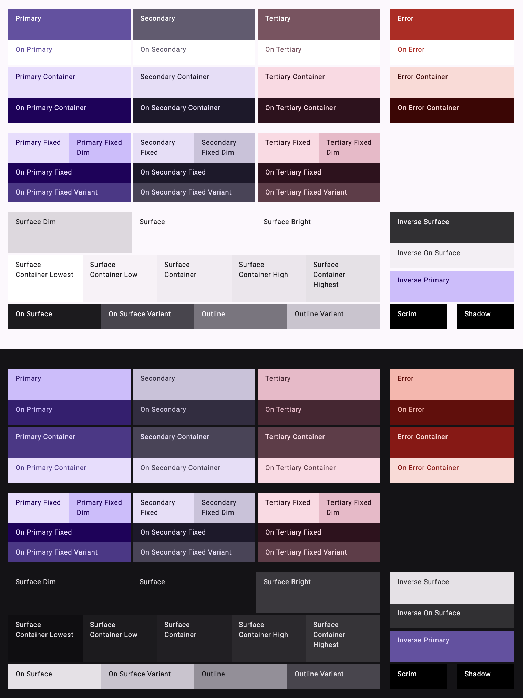

# sixui/ui &middot; [](https://bundlephobia.com/package/@sixui/ui@latest)

Ready-to-use foundational React components.

- Implements Google's [Material Design 3](https://m3.material.io/).
- Leverages Meta's [StyleX](https://github.com/facebook/stylex/) for near zero-runtime styling.
- Fully themable through CSS styles or CSS vars.
- Type-safe APIs, styles and themes.
- Deploys on [Chromatic](https://www.chromatic.com/library?appId=65b3729830a9a664ba7336f5).

## Prepare

```sh
$ nvm use 18
$ yarn set version 4.1.0
$ yarn install
```

## Run for local development

```sh
$ yarn dev
```

Open Storybook at http://localhost:6006.

## Default Color Scheme



## Completed components

Features

- [x] Catalog
- [x] Color theming
- [x] Typography theming
- [x] Motion theming
- [x] Shape theming
- [x] Typescript-based theming
- [x] Catalog

Components

- [x] Avatar
- [x] Badge
- [x] Breadcrumbs
- [x] Button
- [x] Button Base
- [x] Card
  - [x] CardActions
  - [x] CardContent
  - [x] CardHeader
  - [x] CardMedia
  - [x] CardTitle
- [x] Checkbox
- [x] Chip
- [x] Circular Progress Indicator
- [x] Combobox
- [x] Dialog
- [x] Divider
- [x] FAB
- [x] Field
- [x] Icon Button
- [x] Item
- [x] List
- [x] ListItem
- [x] Menu
- [x] MenuList
- [x] MultiCombobox
- [x] MultiSelect
- [x] Paper
- [x] Placeholder
- [x] Radio
- [x] RadioGroup
- [x] Scrim
- [x] Select
- [x] Switch
- [x] Tab
- [x] TabList
- [x] TabPanel
- [x] Tabs
- [x] Text Field
- [x] Typography

Utils

- [x] Anchored
- [x] Component Showcase
- [x] Elevation
- [x] Focus Ring
- [x] Form
- [x] State Layer
- [x] Visual State
- [x] Fade

## Workflow

Create a new branch.

```sh
$ git checkout -b button-color
```

Edit code, ie. `src/components/atoms/Button/Button.tsx`, then commit changes.

```sh
$ git add .
$ git commit -m "Button has a new color."
$ git push -u origin button-color
```

Open a pull request for the `button-color` branch (via GitHub.com or a VSCode plugin). Once opened, the CI job to publish Storybook will run.

If needed, in the list of PR checks at the bottom of the page, click `Storybook Publish` to view the published Storybook with the new changes and review it.

Now merge the PR, navigate to the package on npm, and hang tight for a few minutes while the package is updated.

Checkout main and delete the merged branch.

```sh
$ git checkout main
$ git pull
$ git branch -d button-color
```

## Commit skipping CI

```sh
$ git commit -m "My commit message [skip ci]"
```

## Update Node.js modules

```sh
$ npx npm-check-updates -i
```

## Importing @sixui/ui as a third-party module

### Setup

```sh
$ nvm use 18
$ yarn set version stable
$ yarn add @sixui/ui
```

#### Yarn

```yml
# .yarnrc.yml

# ...
nodeLinker: node-modules
```

```sh
$ yarn install
```

#### StyleX

See https://stylexjs.com/docs/learn/installation/.

### Usage

```tsx
// BasicExample.tsx

'use client';

import { ThemeProvider, baseTheme, FilledTextField } from '@sixui/ui';

const BasicExample: React.FC = () => (
  <ThemeProvider value={{ theme: baseTheme }}>
    <FilledTextField label='Label' />
  </ThemeProvider>
);

export default BasicExample;
```

```tsx
// ThemingExample.tsx

'use client';

import stylex from '@stylexjs/stylex';

import {
  ThemeProvider,
  baseTheme,
  variantTheme,
  FilledButton,
} from '@sixui/ui';
import { componentVars as buttonComponentVars } from '@sixui/ui/themes/base/Button/Button.stylex';
import { componentTheme as buttonVariantTheme } from '@sixui/ui/themes/variant/Button/FilledButton.stylex';
import { colorPaletteTheme } from '@sixui/ui/themes/variant/vars/colorPalettes.stylex';
import {
  colorRolesTheme,
  colorRolesVars,
} from '@sixui/ui/themes/base/vars/colorRoles.stylex';
import { typescaleVars } from '@sixui/ui/themes/base/vars/typo.stylex';

const layoutStyles = stylex.create({
  host: {
    display: 'flex',
    padding: '1rem',
    gap: '1rem',
    alignItems: 'center',
  },
  legend: {
    width: '100px',
    fontFamily: typescaleVars.labelFont$lg,
    fontSize: typescaleVars.labelSize$md,
    fontWeight: typescaleVars.labelWeight$md,
    lineHeight: typescaleVars.labelLineHeight$md,
    letterSpacing: typescaleVars.labelTracking$md,
    color: colorRolesVars.onSurface,
    opacity: '0.5',
    display: 'flex',
    padding: '1rem',
    justifyContent: 'flex-end',
  },
});

const buttonStyles = stylex.create({
  host: {
    [buttonComponentVars.labelTextSize]: '1.2rem',
  },
  label: {
    textTransform: 'uppercase',
  },
});

const ThemingExample: React.FC = () => (
  <>
    <ThemeProvider value={{ theme: baseTheme }}>
      <div {...stylex.props(layoutStyles.host)}>
        <div {...stylex.props(layoutStyles.legend)}>Base theme</div>
        <FilledButton>Default</FilledButton>
        <FilledButton styles={buttonStyles}>Styled</FilledButton>
        <FilledButton theme={buttonVariantTheme}>Locally themed</FilledButton>
      </div>
    </ThemeProvider>

    <ThemeProvider value={{ theme: variantTheme }}>
      <div
        {...stylex.props(layoutStyles.host, colorPaletteTheme, colorRolesTheme)}
      >
        <div {...stylex.props(layoutStyles.legend)}>Variant theme</div>
        <FilledButton>Default</FilledButton>
        <FilledButton styles={buttonStyles}>Styled</FilledButton>
        <FilledButton theme={buttonVariantTheme}>Locally themed</FilledButton>
      </div>
    </ThemeProvider>
  </>
);

export default ThemingExample;
```

#### Notes with Next.js

```js
// next.config.js

const withStylex = require('@stylexjs/nextjs-plugin');
const babelrc = require('./.babelrc.js');
const plugins = babelrc.plugins;
const [_name, options] = plugins.find(
  (plugin) => Array.isArray(plugin) && plugin[0] === '@stylexjs/babel-plugin',
);
const rootDir = options.unstable_moduleResolution.rootDir ?? __dirname;

/** @type {import('next').NextConfig} */
const nextConfig = {
  transpilePackages: ['@sixui/ui'],
};

module.exports = withStylex({
  rootDir,
  useCSSLayers: true,
})(nextConfig);
```

```tsx
// src/app/layout.tsx

import '@sixui/ui/styles.css';

// ...
```

#### Notes with Vite

```sh
$ yarn add vite-plugin-stylex --dev
```

```js
// vite.config.ts

import { defineConfig } from 'vite';
import react from '@vitejs/plugin-react';
import styleX from 'vite-plugin-stylex';

// https://vitejs.dev/config/
export default defineConfig({
  plugins: [react(), styleX()],
  optimizeDeps: {
    exclude: ['@sixui/ui'],
  },
});
```

```tsx
// src/main.tsx

import '@sixui/ui/styles.css';

// ...
```

#### Notes with `react-router-dom`

```tsx
import { forwardRef } from 'react';
import {
  Link as RouterLink,
  LinkProps as RouterLinkProps,
} from 'react-router-dom';
import { FilledButton } from '@sixui/ui';

export const LinkBehavior = forwardRef<
  HTMLAnchorElement,
  Omit<RouterLinkProps, 'to'> & { href: RouterLinkProps['to'] }
>(function LinkBehavior(props, ref) {
  const { href, ...other } = props;

  // Map href (sixui) -> to (react-router)
  return <RouterLink ref={ref} to={href} {...other} />;
});

export const Usage: React.FC = () => (
  <FilledButton component={LinkBehavior} href='/login'>
    Login
  </FilledButton>
);
```

### Setup Storybook (optional)

```sh
$ npx storybook@latest init
```

```js
// .storybook/main.js

// (...)
export default {
  // (...)
  refs: {
    'design-system': {
      title: 'sixui',
      url: 'https://654a07f6d5de71f31c8d0568-ncheukrqdk.chromatic.com',
    },
  },
};

export default config;
```

### Tokens (.env)

Used to run `yarn release` locally.

#### GITHUB_TOKEN

Create a [fine-grained token](https://github.com/settings/tokens?type=beta) on GitHub with the following scopes:

- Repository access
  - sixui/ui
- Repository permissions
  - repo:issues (rw)
  - repo:workflow (rw)
  - repo:contents (rw)
  - repo:pull-requests (r)

### NPM_TOKEN

Used to run `yarn release` locally.

Create a [granular access token](https://www.npmjs.com/settings/olivierpascal/tokens) on npmjs with the following scopes:

- Packages and scopes
  - @sixui

## Troubleshooting

> Error: Working directory is not clean, make sure all files are committed

Make sure that `package.json` ends with a newline.
